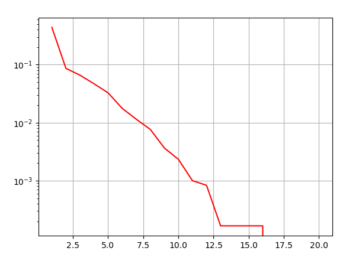

The tests implemented in this folder assure that the modulation and error correction 
software on AcubeSAT perform as intended.

## Error Correction Testing

### BCH Decoding

---
```bchTest.cpp``` includes tests for the BCH decoder.

### Convolutional Encoding

---
```convolutionalTest.cpp``` uses data generated by this 
[python implemenetation](https://gitlab.com/acubesat/comms/software/gnuradio-blocks/-/blob/master/prototypes/convolutional.py) 
of the convolutional encoder as defined in [131x0b4](https://public.ccsds.org/Pubs/131x0b4.pdf) which is stored in the ```data``` folder and checks that the encoder implemented in ```ConvolutionalEncoder``` generates the same codeword. It also checks that a bitstream of zeros generates a codeword of just zeros as expected.
## Modulation Testing

### OQPSK

---

#### I/Q Data

First of all, using a randomly generated signal as the OQPSK modulator's input, it is checked that
the I/Q phasor plot matches the plot that is provided by this [CCSDS Standard](https://public.ccsds.org/Pubs/413x0g2s.pdf):


In comparison the I/Q phasor plot produced in `oqpskTest.cpp` is very similar:


#### Time Plot

Also, it is important to check that the time plot for a given repeated packet, is similar to
that of the GNURadio OQPSK modulator for the same input. Here is the time plot produced from
the tests (with a repeated 8-bit packet as input):


With the same input the GNURadio time plot looks like this which matches the plot from `oqpskTest.cpp`:


### GMSK

---

#### BER Calculation

In `gmskTest.cpp` multiple random packets are modulated, passed through a noise channel
and then demodulated, for 20 different noise scenarios (SNRs). The BER is calculated for each SNR and plotted:



These results match those from the octave prototype:

